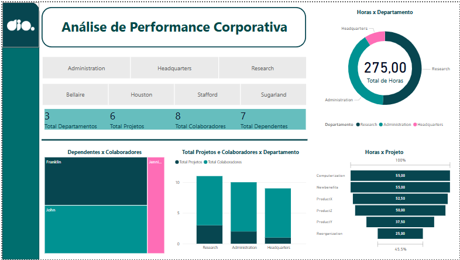
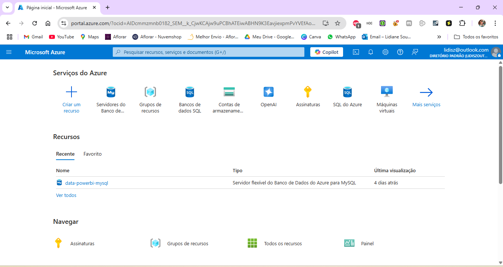
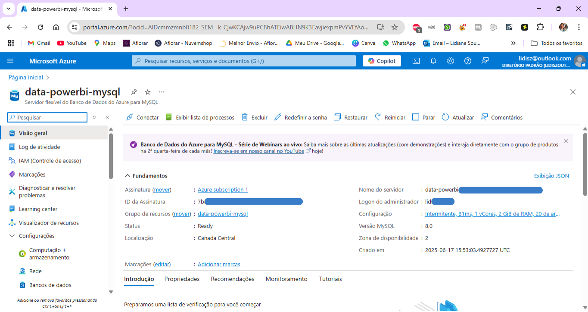
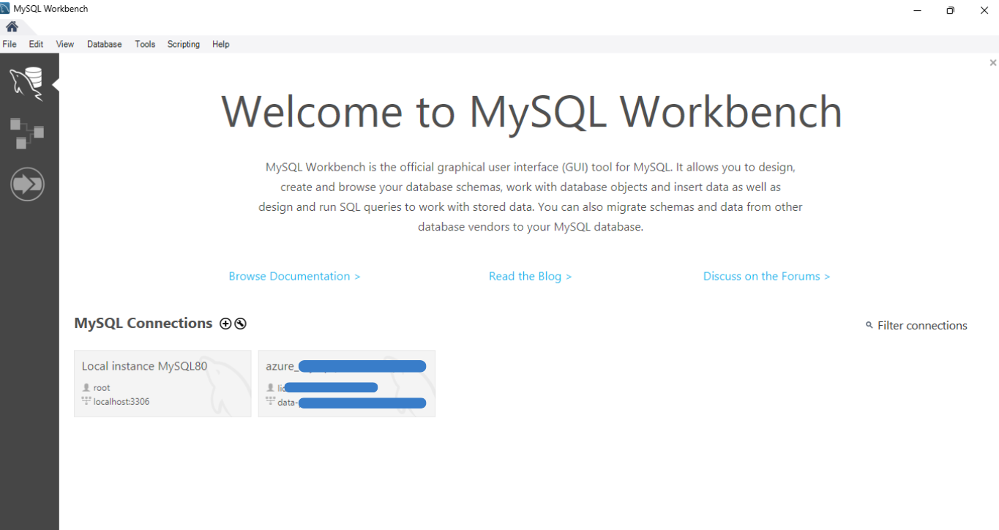
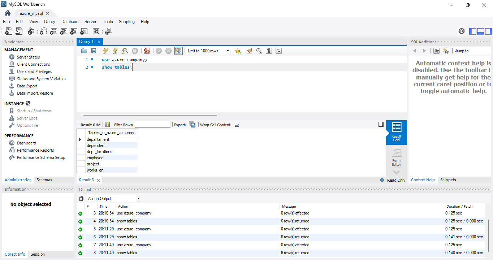

# ☁️ Desafio DIO – Integração de Dados com MySQL Azure + Power BI 📊

Este repositório apresenta a solução do desafio prático da **DIO**, no qual explorei a integração de dados via **MySQL no Azure**, realizei transformações utilizando **Power Query**, e desenvolvi um dashboard interativo com **Power BI**, focado na análise de projetos, colaboradores, departamentos e alocação de horas.

## 🎯 Objetivos

- Criar uma instância MySQL na Azure e subir a base de dados fornecida
- Tratar, limpar e transformar os dados com foco em análise
- Integrar o Power BI com o MySQL na nuvem
- Construir um dashboard visual, intuitivo e estratégico

## 🧰 Tecnologias e Ferramentas

- Microsoft Azure (MySQL Database)
- MySQL Workbench
- Power BI Desktop
- Power Query (ETL)
- GitHub + Markdown

## ⚙️ Transformações e Modelagem

- Conexão com banco de dados **Azure MySQL** diretamente no Power BI  
- Criação e relacionamento de tabelas no Power Query (Employee, Department, Project, Works_On, Dependent)  
- Padronização de tipos de dados (inteiros, texto, horas)  
- Eliminação de colunas não utilizadas para otimizar o modelo  
- Modelagem final consolidando colaboradores, departamentos, projetos e dependentes

> ℹ️ Todas as transformações foram realizadas no Power BI utilizando **Power Query** e editor de relacionamentos visual, sem a necessidade de escrever comandos SQL.

## 📊 Resultado Final

O dashboard desenvolvido permite:

- Visualizar **KPIs por departamento e localidade**
- Avaliar **horas alocadas por projeto**
- Filtrar dinamicamente por **colaboradores, gerentes e áreas**
- Compreender a **estrutura organizacional** de forma rápida e clara

## 🖼️ Galeria de Prints

| Etapa                         | Miniatura Clicável                                                                                     | Descrição                              |
|------------------------------|--------------------------------------------------------------------------------------------------------|----------------------------------------|
| Dashboard Final              | [](./assets/dashboard-preview.png)              | Visualização final no Power BI         |
| Instância MySQL na Azure     | [](./assets/azure-instance1.png)<br>[](./assets/azure-instance2.png)                    | Configuração da instância no portal    |
| Conexão no MySQL Workbench   | [](./assets/workbench-connection1.png)<br>[](./assets/workbench-connection2.png)        | Teste de conexão com a base de dados   |


## 📎 Desafio Original

Você pode acessar o PDF com a descrição completa do desafio proposto pela DIO no link abaixo:

📄 [Download do PDF do Desafio](./assets/desafio-dio.pdf)


## 📦 Arquivos do Projeto

- 📄 [Dashboard em PDF](./assets/dashboard-final.pdf)  
- 💾 [Arquivo Power BI (.pbix)](./dashboard-final.pbix)


## 🗂️ Estrutura do Repositório

```bash
📦 dashboard-powerbi-azure-mysql
 ┣ 📂 assets/
 ┃ ┣ azure-instance1.png
 ┃ ┣ azure-instance2.png
 ┃ ┣ dashboard-final.pdf
 ┃ ┣ dashboard-preview.png
 ┃ ┣ desafio-dio.pdf
 ┃ ┣ workbench-connection1.png
 ┃ ┗ workbench-connection2.png
 ┣ 📂 data/
 ┃ ┣ azure_company departament.xlsx
 ┃ ┣ azure_company dependent.xlsx
 ┃ ┣ azure_company dept_locations.xlsx
 ┃ ┣ azure_company employee.xlsx
 ┃ ┣ azure_company project.xlsx
 ┃ ┗ azure_company works_on.xlsx
 ┣ 📄 dashboard-final.pbix
 ┣ 📄 README.md
```

## ✨ Aprendizados

Esse desafio foi essencial para consolidar conhecimentos em **MySQL, cloud e BI**. Pude aplicar boas práticas de modelagem, limpeza e visualização de dados em um contexto próximo ao ambiente de trabalho real.

## 🙋‍♀️ Sobre Mim

Me chamo **Lidiane**, sou entusiasta da área de dados e apaixonada por transformar complexidade em clareza. Este projeto representa minha dedicação e evolução como profissional em formação.
